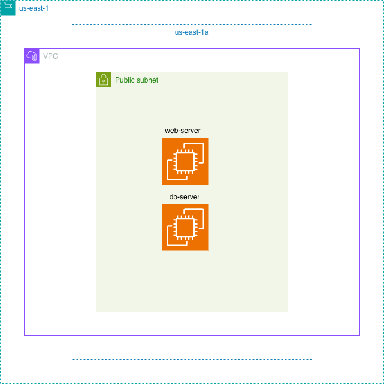

# Terraform AWS Data Sources Project

## Overview

This project demonstrates how to use Terraform Data Sources to dynamically discover and reference existing AWS infrastructure instead of hardcoding resource IDs directly into Terraform configurations.

The infrastructure deploys two ARM64-based EC2 instances (`web-server` and `db-server`) into an existing public subnet inside the AWS Default VPC within the `us-east-1` region.

Rather than provisioning an entirely new networking stack, the project leverages Terraform `data` blocks to dynamically retrieve:

- Existing AWS Default VPC
- Existing subnet in `us-east-1a`
- Latest Ubuntu 26.04 ARM64 AMI from Canonical
- Subnet metadata and Availability Zone information

The project also demonstrates remote Terraform state management using an Amazon S3 backend with encryption and state locking enabled.

This repository is focused on building a strong foundational understanding of:

- Terraform Data Sources
- Infrastructure discovery
- Dynamic AWS infrastructure configuration
- ARM64 EC2 deployments using AWS Graviton
- Terraform remote state management
- Infrastructure scalability using `for_each`

---

# Architecture Diagram



---

# Architecture Overview

The infrastructure architecture consists of:

- One existing AWS Default VPC
- One existing public subnet located in `us-east-1a`
- Two EC2 instances:
  - `web-server`
  - `db-server`
- Remote Terraform state stored in Amazon S3

Both EC2 instances are deployed into the same public subnet using:

- Ubuntu 26.04 ARM64
- AWS Graviton-based `t4g.micro` instances

Terraform dynamically discovers and references existing AWS resources using data sources instead of manually hardcoding IDs or provisioning entirely new networking infrastructure.

---

# Project Goals

The primary goals of this project are to:

- Understand Terraform Data Sources
- Learn infrastructure discovery in AWS
- Deploy ARM64 EC2 instances
- Configure Terraform remote backends
- Practice infrastructure iteration using `for_each`
- Improve Terraform debugging and output usage
- Build reusable and maintainable Infrastructure as Code

---

# Technologies Used

| Technology | Purpose |
|---|---|
| Terraform | Infrastructure as Code |
| AWS EC2 | Compute resources |
| AWS VPC | Networking |
| AWS S3 | Remote Terraform backend |
| Ubuntu 26.04 ARM64 | EC2 operating system |
| AWS Graviton | ARM-based compute architecture |
| Terraform AWS Provider v6 | AWS provider integration |

---

# Project Structure

```bash
.
├── backend.tf
├── provider.tf
├── data.tf
├── locals.tf
├── main.tf
├── outputs.tf
├── variables.tf
├── diagram_1.drawio.png
└── README.md
```

---

# Infrastructure Workflow

The workflow of this project is:

1. Terraform authenticates with AWS
2. Existing AWS infrastructure is discovered using data sources
3. Terraform retrieves:
   - Existing VPC
   - Existing subnet
   - Latest Ubuntu ARM64 AMI
4. Terraform dynamically creates EC2 instances using `for_each`
5. Terraform stores infrastructure state remotely in S3

---

# Terraform Backend Configuration

Terraform state is stored remotely in Amazon S3.

## backend.tf

```hcl
terraform {
  backend "s3" {
    bucket       = "amazon-remote-s3-backend"
    key          = "dev/terraform.tfstate"
    region       = "us-east-1"
    use_lockfile = true
    encrypt      = true
  }
}
```

## Benefits of Remote State

- Centralized state management
- Team collaboration support
- State locking protection
- Reduced risk of local state corruption
- Improved infrastructure consistency

---

# AWS Provider Configuration

## provider.tf

```hcl
terraform {
  required_providers {
    aws = {
      source  = "hashicorp/aws"
      version = "~> 6.0"
    }
  }
}

provider "aws" {
  region = var.region
}
```

Default region:

```hcl
default = "us-east-1"
```

---

# Terraform Data Sources

One of the core learning objectives of this project is understanding Terraform Data Sources.

Data sources allow Terraform to retrieve information about existing infrastructure components without managing or recreating them.

---

## Existing VPC Lookup

Terraform dynamically retrieves the existing VPC using:

```hcl
data "aws_vpc" "dev_vpc" {
  filter {
    name   = "tag:Name"
    values = ["my-default-vpc"]
  }
}
```

This avoids hardcoding the VPC ID directly into the configuration.

---

## Existing Subnet Lookup

Terraform dynamically retrieves the subnet using:

```hcl
data "aws_subnet" "dev_subnets" {
  filter {
    name   = "vpc-id"
    values = [data.aws_vpc.dev_vpc.id]
  }

  filter {
    name   = "tag:Name"
    values = ["df-subnet-az-us-east-1a"]
  }
}
```

This ensures the subnet belongs to the correct VPC and Availability Zone.

---

## Ubuntu ARM64 AMI Lookup

Terraform retrieves the latest Ubuntu ARM64 image from Canonical using:

```hcl
data "aws_ami" "ubuntu_26_04_arm64"
```

### Filters Applied

- Ubuntu 26.04
- ARM64 architecture
- HVM virtualization
- EBS-backed storage

This guarantees compatibility with AWS Graviton-based EC2 instances.

---

# Local Values

Terraform locals are used to define reusable EC2 instance configurations.

## locals.tf

```hcl
locals {
  ec2_instances = {
    web = {
      name = "web-server"
      type = "t4g.micro"
    }

    db = {
      name = "db-server"
      type = "t4g.micro"
    }
  }
}
```

---

# EC2 Deployment

Terraform dynamically creates multiple EC2 instances using:

```hcl
for_each = local.ec2_instances
```

This approach improves scalability and reduces repetitive code.

## Instances Created

| Instance Name | Instance Type |
|---|---|
| web-server | t4g.micro |
| db-server | t4g.micro |

---

# ARM64 Deployment

This project uses AWS Graviton ARM-based compute resources.

## Instance Type

```hcl
t4g.micro
```

## Benefits of ARM64

- Lower cost
- Better energy efficiency
- Improved performance-per-dollar
- Modern cloud-native architecture

The Ubuntu AMI is also ARM64 compatible to ensure architecture alignment.

---

# Outputs

The project exports useful infrastructure metadata using Terraform outputs.

## Example Outputs

```bash
vpc_tag                    = "my-default-vpc"
subnet_public_or_private   = "public"
aws_ami_architecture       = "arm64"
subnet_az                  = "us-east-1a"
```

## Available Outputs

- VPC ID
- VPC Name
- Subnet Name
- Subnet Availability Zone
- AMI ID
- AMI Architecture
- Public/Private subnet status
- EC2 instance tags

---

# Prerequisites

Before running this project, ensure you have:

- AWS Account
- Terraform installed
- AWS CLI installed
- AWS credentials configured
- Existing Default VPC
- Existing subnet in `us-east-1a`
- S3 bucket for Terraform backend

---

# Required AWS Resource Tags

This project relies on Terraform Data Sources that search resources by tags.

You must manually tag your AWS resources before deployment.

---

## Required VPC Tag

```text
my-default-vpc
```

---

## Required Subnet Tag

```text
df-subnet-az-us-east-1a
```

---

# How to Run the Project

## 1. Clone the Repository

```bash
git clone https://github.com/chosenmustapha/mastering-terraform.git
cd Data-source
```

---

## 2. Initialize Terraform

```bash
terraform init
```

---

## 3. Validate the Configuration

```bash
terraform validate
```

---

## 4. Review the Execution Plan

```bash
terraform plan
```

---

## 5. Deploy the Infrastructure

```bash
terraform apply
```

---

# Verify Deployment

After deployment, verify:

- Both EC2 instances are running
- Instances exist inside the correct subnet
- Terraform state exists in S3
- Outputs display expected values
- Instances use ARM64 architecture

---

# Example Terraform Plan Output

```bash
Plan: 2 to add, 0 to change, 0 to destroy.
```

---

# Key Terraform Concepts Demonstrated

| Concept | Description |
|---|---|
| Data Sources | Discover existing AWS infrastructure |
| Locals | Store reusable configuration values |
| for_each | Dynamically create multiple resources |
| Outputs | Export infrastructure metadata |
| Remote Backend | Store Terraform state remotely |
| Variables | Parameterize infrastructure configuration |

---

# Troubleshooting

## AMI Architecture Mismatch

If you receive an error similar to:

```bash
The architecture 'x86_64' does not match the architecture 'arm64'
```

ensure:

- The AMI architecture is ARM64
- The EC2 instance type supports ARM architecture
- Example compatible instance type:

```hcl
t4g.micro
```

---

# Final Notes

This project focuses heavily on Terraform Data Sources and demonstrates how infrastructure can dynamically adapt to existing AWS environments without hardcoding resource IDs directly into Terraform configurations.

This approach improves:

- Scalability
- Reusability
- Maintainability
- Infrastructure portability