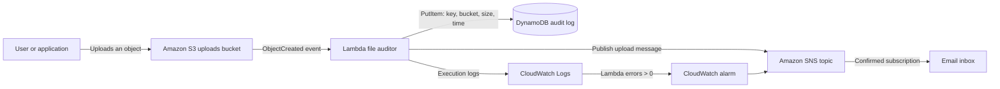

# Serverless File Audit Pipeline

An event-driven AWS pipeline that records every file uploaded to an S3 bucket and sends an email notification for the upload. Infrastructure is defined with Terraform and the processing logic runs in AWS Lambda.

The project solves a common operational need: teams often need an auditable record of files arriving in cloud storage without polling buckets or operating a server. Each S3 object-creation event invokes a Lambda function, which stores upload metadata in DynamoDB and publishes a human-readable notification through Amazon SNS. CloudWatch Logs and an error alarm make failures visible.

## Architecture



## Quick Start

Use this path if your AWS credentials are already configured and you have created the remote-state bucket described in the next section.

```zsh
git clone https://github.com/chosenmustapha/mastering-terraform.git
cd serverless-file-audit-pipeline

terraform init
terraform plan -var="notification_email=you@example.com"
terraform apply -var="notification_email=you@example.com"
```

Confirm the SNS subscription email, then follow [Verify the Pipeline](#verify-the-pipeline) to upload a test object. Replace `<your-repository-url>` and `you@example.com` with your own values.

## What It Deploys

| AWS service | Purpose | Terraform resource |
| --- | --- | --- |
| Amazon S3 | Receives uploaded files and emits object-created events. | `aws_s3_bucket.uploads` |
| AWS Lambda | Processes S3 events, writes audit records, and publishes notifications. | `aws_lambda_function.file_auditor` |
| Amazon DynamoDB | Stores one audit record per upload, keyed by file key and upload timestamp. | `aws_dynamodb_table.audit_log` |
| Amazon SNS | Delivers upload notifications and Lambda-error alarm notifications by email. | `aws_sns_topic.upload_notifications` |
| IAM | Grants the Lambda only the permissions it needs for S3, DynamoDB, SNS, and CloudWatch Logs. | `aws_iam_role.lambda_exec_role` |
| Amazon CloudWatch | Retains Lambda logs and alarms when the `Errors` metric is greater than zero. | `aws_cloudwatch_log_group.lambda_logs`, `aws_cloudwatch_metric_alarm.lambda_errors` |

## Repository Layout

```text
.
├── backend.tf                 # Encrypted S3 remote-state backend with lockfile support
├── cloudwatch.tf              # Lambda log group and error alarm
├── data.tf                    # Current AWS account identity lookup
├── dynamodb.tf                # Audit table
├── iam.tf                     # Lambda trust policy and least-privilege permissions
├── lambda/
│   └── lambda_function.py     # S3 event handler
├── lambda.tf                  # Lambda packaging, configuration, and S3 invoke permission
├── outputs.tf                 # Bucket, Lambda, and table outputs
├── provider.tf                # AWS and archive provider requirements
├── requirements.txt           # Python dependency for local development
├── s3.tf                      # Upload bucket and event notification
├── sns.tf                     # Notification topic and email subscription
├── terraform.tfvars           # Project name and log-retention configuration
└── variables.tf               # Input variable declarations
```

## Prerequisites

Before deploying, make sure you have:

- An AWS account and AWS CLI credentials configured for the target account.
- Terraform installed. This project uses an S3 backend with `use_lockfile = true`, so use a current Terraform release that supports S3 lockfiles.
- AWS CLI v2 for the verification commands below.
- Python 3.13 for local development, matching the Lambda runtime. Python is not required to deploy because Terraform packages the existing Lambda source file.
- Permissions to create and manage S3, Lambda, IAM roles and inline policies, DynamoDB, SNS, CloudWatch Logs/alarms, and the remote-state S3 bucket.

Confirm that the intended AWS account and region are active before applying:

```zsh
aws sts get-caller-identity
aws configure get region
```

The default deployment region is `us-east-1`; change `region` only if you also update the backend configuration as described below.

## Deployment Guide

### 1. Bootstrap remote state

Terraform state is configured in `backend.tf` to use an S3 bucket named `amazon-remote-s3-backend`, with the state object stored at `dev/terraform.tfstate`. This bucket must already exist before `terraform init` runs; it is deliberately not created by this stack.

Use a unique bucket name in your own account. Set the name below, create the bucket in `us-east-1`, and then replace the `bucket` value in `backend.tf` with that name:

```zsh
state_bucket="my-unique-terraform-state-bucket"

aws s3api create-bucket --bucket "$state_bucket" --region us-east-1
aws s3api put-bucket-versioning \
  --bucket "$state_bucket" \
  --versioning-configuration Status=Enabled
aws s3api put-bucket-encryption \
  --bucket "$state_bucket" \
  --server-side-encryption-configuration '{"Rules":[{"ApplyServerSideEncryptionByDefault":{"SSEAlgorithm":"AES256"}}]}'
```

For a backend outside `us-east-1`, create the bucket with the appropriate `--create-bucket-configuration LocationConstraint=<region>` and update the `region` in `backend.tf`. Backend settings cannot reference Terraform input variables, so the bucket name and region must be written directly in that file before `terraform init`.

The AWS identity running Terraform needs permission to read, write, list, and lock objects in the backend bucket. S3 bucket names are global; do not reuse the example name in a shared or production account.

> Do not store Terraform state in the same stack it manages. Remote-state infrastructure should be bootstrapped separately so Terraform can initialize before this project exists.

### 2. Set project inputs

`terraform.tfvars` supplies the project name and CloudWatch log retention:

```hcl
project_name       = "file-audit-pipeline"
log_retention_days = 14
```

Provide the notification email at apply time. This avoids storing a personal email address in `terraform.tfvars`:

```zsh
terraform apply -var="notification_email=you@example.com"
```

Alternatively, set the standard Terraform environment variable before running commands:

```zsh
export TF_VAR_notification_email="you@example.com"
```

### Input Variables

| Name | Type | Default | Description |
| --- | --- | --- | --- |
| `project_name` | `string` | none | Prefix used for the AWS resource names. |
| `notification_email` | `string` | none | Email endpoint subscribed to the SNS topic. |
| `region` | `string` | `us-east-1` | AWS region for the deployed resources. |
| `log_retention_days` | `number` | none | Number of days to retain Lambda logs. |

### 3. Initialize and deploy

From the project directory:

```zsh
terraform init
terraform fmt -check
terraform validate
terraform plan -var="notification_email=you@example.com"
terraform apply -var="notification_email=you@example.com"
```

Review the plan before approving it. Terraform creates resources with these name patterns:

```text
S3 bucket:       <project_name>-uploads-<aws_account_id>
Lambda function: <project_name>-file-auditor
DynamoDB table:  <project_name>-audit-log
SNS topic:       <project_name>-upload-notifications
IAM role:        <project_name>-lambda-exec-role
```

After a successful apply, view the generated resource names:

```zsh
terraform output
```

## Confirm the Email Subscription

SNS email subscriptions must be manually confirmed. After Terraform creates the subscription:

1. Find the **AWS Notification - Subscription Confirmation** email in the inbox, spam, promotions, or all-mail folders for `notification_email`.
2. Open the email and select **Confirm subscription**.
3. In the SNS console, verify that the subscription status is `Confirmed` rather than `PendingConfirmation`.

SNS does not replay messages published while the subscription was pending. Upload a new object after confirmation to receive a test notification.

## Verify the Pipeline

### Upload a test file

```zsh
printf "test upload\n" > /tmp/file-audit-test.txt
aws s3 cp /tmp/file-audit-test.txt "s3://$(terraform output -raw uploads_bucket_name)/"
rm /tmp/file-audit-test.txt
```

Expected results:

1. S3 emits an `s3:ObjectCreated:*` event.
2. The Lambda function records the file key, bucket, object size, and UTC timestamp in DynamoDB.
3. SNS sends an email with the uploaded object details.

### Inspect the DynamoDB audit record

```zsh
aws dynamodb scan \
  --table-name "$(terraform output -raw dynamodb_table_name)" \
  --region us-east-1
```

For this small demonstration project, `scan` is convenient. Production applications should prefer `Query` and a data model tailored to their access patterns.

### Stream Lambda logs

```zsh
aws logs tail \
  "/aws/lambda/$(terraform output -raw lambda_function_name)" \
  --since 10m \
  --follow \
  --region us-east-1
```

### Verify alerting

The CloudWatch alarm evaluates the Lambda `Errors` metric every five minutes. An error count greater than zero triggers the same SNS topic used for upload notifications. Confirmed email subscribers therefore receive both operational alerts and successful-upload messages.

## Lambda Behavior

The handler in `lambda/lambda_function.py` performs the following work for each S3 record in an event:

1. Reads the bucket name, object key, and object size from the S3 event payload.
2. URL-decodes the object key.
3. Creates a UTC timestamp.
4. Writes `file_key`, `uploaded_at`, `bucket`, and `size_bytes` to DynamoDB.
5. Publishes a formatted email message to the SNS topic.

Terraform passes the table name and topic ARN through these Lambda environment variables:

| Variable | Source |
| --- | --- |
| `DYNAMODB_TABLE_NAME` | `aws_dynamodb_table.audit_log.name` |
| `SNS_TOPIC_ARN` | `aws_sns_topic.upload_notifications.arn` |

The Lambda deployment package is built from `lambda/lambda_function.py` by the `archive_file` data source. The configured `source_code_hash` ensures Terraform updates Lambda code when that source file changes.

## Local Python Development

`requirements.txt` contains `boto3` for local imports and tooling. AWS Lambda's Python runtime provides `boto3`, so the current deployment package only needs the handler source file.

Create a virtual environment with the same Python major/minor version as the Lambda runtime:

```zsh
python3.13 -m venv .venv
source .venv/bin/activate
python -m pip install --upgrade pip
python -m pip install -r requirements.txt
```

Running `python lambda/lambda_function.py` only imports the module; it does not invoke `lambda_handler` with an S3 event. The module also needs `DYNAMODB_TABLE_NAME`, `SNS_TOPIC_ARN`, and AWS credentials to initialize successfully. Use a real S3 upload, the Lambda console, or an event-driven test harness to exercise the handler.

If you add third-party dependencies beyond the AWS-provided SDK, update the Lambda packaging step so the installed packages are included in `lambda/lambda_function.zip` before deployment.

## Security and Operational Notes

- The Lambda role is scoped to `s3:GetObject` on the upload bucket, `dynamodb:PutItem` on the audit table, `sns:Publish` on the notification topic, and required CloudWatch Logs actions.
- The bucket name includes the AWS account ID to avoid most name collisions; it is still publicly addressable by name, so keep `project_name` appropriate for your environment.
- The remote backend enables S3 server-side encryption and should use versioning to protect state history. Restrict access to state because it can contain sensitive resource metadata.
- Commit `.terraform.lock.hcl` to keep provider selections reproducible. Do not commit `.terraform/`, `.venv/`, Terraform state files, generated Lambda ZIP files, or ad hoc test uploads.
- Email SNS subscriptions require human confirmation. Destroying the stack removes the managed subscription; a subsequent apply creates a new confirmation request.

A useful `.gitignore` for this project is:

```gitignore
.terraform/
*.tfstate
*.tfstate.*
.venv/
__pycache__/
*.py[cod]
lambda/lambda_function.zip
```

## Troubleshooting

| Symptom | Likely cause | Resolution |
| --- | --- | --- |
| No email after upload | The SNS subscription is pending or the Lambda failed. | Confirm the email subscription, upload a new object, then inspect CloudWatch Logs. |
| `MalformedPolicyDocument` when creating the IAM role | The Lambda trust-policy principal type is invalid. | Ensure the trust policy uses `type = "Service"` and `identifiers = ["lambda.amazonaws.com"]`. |
| `KeyError: 'DYNAMODB_TABLE_NAME'` while running Python locally | Lambda environment variables are not automatically present on your computer. | Set the required environment variables for local tests, or invoke through AWS after deployment. |
| Terraform cannot initialize the backend | The backend bucket does not exist, is in the wrong region, or your credentials lack access. | Create/configure the bucket first, then rerun `terraform init -reconfigure`. |
| `terraform destroy` cannot delete the upload bucket | The bucket contains uploaded objects. | Empty the bucket before destroying the stack. |

## Destroy the Stack

Remove uploaded objects first because the S3 bucket is not configured with `force_destroy`:

```zsh
aws s3 rm "s3://$(terraform output -raw uploads_bucket_name)" --recursive
terraform destroy -var="notification_email=you@example.com"
```

`terraform destroy` removes the pipeline resources, including the S3 bucket, Lambda function, DynamoDB table, SNS topic and subscription, CloudWatch resources, and IAM role. It does **not** remove the separately managed remote-state bucket.
