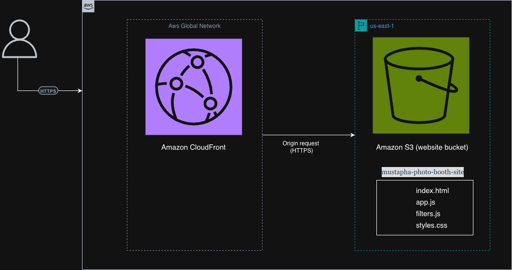

# AWS Static Website Hosting with Terraform

This project provisions and deploys a static website on AWS using Terraform Infrastructure as Code (IaC). The solution combines Amazon S3 for object storage and website hosting with Amazon CloudFront for secure, low-latency content delivery over HTTPS. The project demonstrates cloud infrastructure provisioning, CDN integration, remote state management, and real-world AWS troubleshooting.

## Project Overview

This project demonstrates how to provision and deploy a production-style static website hosting solution on AWS using Terraform Infrastructure as Code (IaC).

The solution leverages Amazon S3 for static asset storage and Amazon CloudFront as a global Content Delivery Network (CDN) to securely deliver content over HTTPS with low latency. All infrastructure is defined and managed through Terraform, enabling consistent, repeatable, and automated deployments.

The primary goal of this project is to demonstrate foundational cloud engineering concepts including Infrastructure as Code, static website hosting, content delivery optimization, and AWS resource provisioning.

---

## Key Features

- Infrastructure provisioned entirely with Terraform
- Static website hosting using Amazon S3
- Global content delivery through Amazon CloudFront
- HTTPS enabled through CloudFront's default certificate
- Automated website asset uploads
- Remote Terraform state stored in Amazon S3
- Reproducible and version-controlled infrastructure

---

## Architecture



### Architecture Components

- **Amazon S3 Website Bucket** stores all website assets.
- **Amazon CloudFront** acts as the global CDN layer.
- **HTTPS** is enforced through CloudFront.
- **Terraform** provisions and manages all infrastructure resources.

### Traffic Flow

1. A user accesses the CloudFront distribution URL.
2. The request is routed to the nearest CloudFront edge location.
3. CloudFront checks whether the requested content is already cached.
4. If the content is cached, CloudFront immediately returns the response.
5. If the content is not cached, CloudFront sends an origin request to Amazon S3.
6. Amazon S3 returns the requested object.
7. CloudFront caches the object and delivers the response to the user.

---

## Technologies Used

| Technology | Purpose |
|------------|---------|
| Terraform | Infrastructure as Code |
| Amazon S3 | Static website hosting |
| Amazon CloudFront | Global content delivery |
| AWS CLI | Authentication and deployment management |

---

## Project Structure

```text
.
├── README.md
├── assets
│   └── architecture-diagram.png
├── terraform
│   ├── backend.tf
│   ├── cloudfront.tf
│   ├── provider.tf
│   ├── s3.tf
│   ├── terraform.tfvars
│   └── variables.tf
└── website
    ├── app.js
    ├── filters.js
    ├── index.html
    └── styles.css
```

### Directory Breakdown

| Directory | Description |
|------------|-------------|
| assets | Documentation assets such as architecture diagrams |
| terraform | Terraform configuration files used to provision AWS infrastructure |
| website | Static website source files uploaded to Amazon S3 |

---

## Infrastructure Components

### Amazon S3

Amazon S3 serves as the origin storing all HTML, CSS, JavaScript, and static website assets.

### Amazon CloudFront

CloudFront provides HTTPS support, content caching, automatic compression, and global content delivery to reduce latency.

### Terraform Remote Backend

Terraform remote state is stored in Amazon S3 to enable centralized state management and facilitate collaboration.

---

## Prerequisites

Before deploying this project, ensure the following tools are installed:

- Terraform
- AWS CLI
- AWS Account

Configure AWS credentials:

```bash
aws configure
```

---

## Deployment Guide

### Clone the Repository

```bash
git clone https://github.com/chosenmustapha/mastering-terraform.git
cd web-hosting-project
```

### Navigate to the Terraform Directory

```bash
cd terraform
```

### Initialize Terraform

```bash
terraform init
```

### Review the Execution Plan

```bash
terraform plan
```

Review the execution plan carefully before provisioning resources.

### Deploy the Infrastructure

```bash
terraform apply
```

When prompted:

```text
yes
```

Terraform will provision:

- Amazon S3 bucket
- Website configuration
- CloudFront distribution
- Website assets
- Remote state integration

---

## Validation

After deployment completes:

1. Navigate to the CloudFront distribution URL.
2. Verify the website loads successfully.
3. Confirm JavaScript and CSS assets are loading correctly.
4. Verify HTTPS is automatically enforced.
5. Verify content is being served through CloudFront.

---

## Troubleshooting and Lessons Learned

One of the most valuable aspects of this project was troubleshooting real AWS deployment issues. The following challenges were encountered during implementation and resolved through investigation and testing.

### Issue 1: CloudFront Returned AccessDenied

#### Error

```xml
<Code>AccessDenied</Code>
<Message>Access Denied</Message>
```

#### Root Cause

CloudFront could not retrieve website objects from the S3 bucket.

#### Resolution

A bucket policy was added to allow public read access to website objects:

```hcl
Action = ["s3:GetObject"]
```

This allowed CloudFront and end users to retrieve static website assets.

---

### Issue 2: S3 Bucket Policy Failed to Apply

#### Error

```text
AccessDenied: because public policies are prevented by the BlockPublicPolicy setting
```

#### Root Cause

S3 Block Public Access settings were preventing Terraform from attaching the bucket policy.

#### Resolution

The bucket's public access configuration was updated to allow bucket policies while maintaining ACL protections.

```hcl
block_public_policy     = false
restrict_public_buckets = false
```

---

### Issue 3: Website Downloaded Instead of Rendering

#### Root Cause

Objects were uploaded without the correct Content-Type metadata.

Browsers interpreted files as downloadable content rather than renderable web assets.

#### Resolution

Explicit content types were assigned during object uploads.

```hcl
html = "text/html"
css  = "text/css"
js   = "application/javascript"
```

This ensured browsers rendered the website correctly.

---

## Skills Demonstrated

- Infrastructure as Code (Terraform)
- AWS Cloud Architecture
- Amazon S3
- Amazon CloudFront
- Remote State Management
- Static Website Hosting
- Cloud Troubleshooting
- Infrastructure Deployment Automation

---

## Cleanup

To remove all provisioned resources:

```bash
terraform destroy
```

When prompted:

```text
yes
```

---

## Future Enhancements

- Route 53 DNS management
- AWS Certificate Manager (ACM)
- GitHub Actions CI/CD pipeline
- CloudWatch monitoring and observability

---